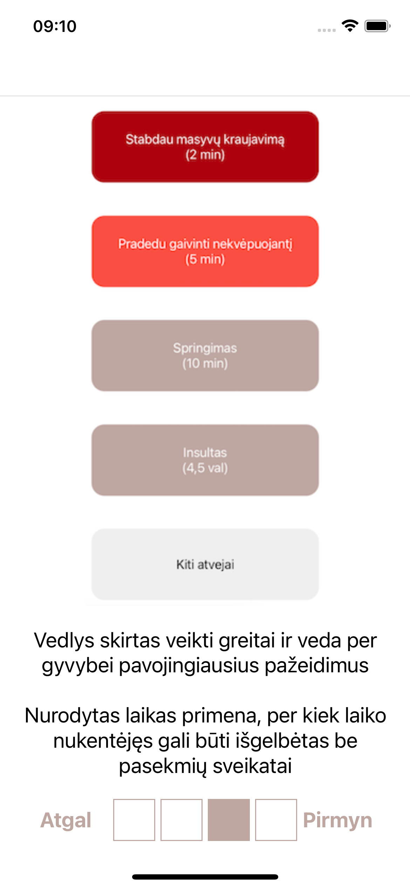

# Mama App

## LT

Programėlė pateikia instrukcijas, kaip suteikti pirmąją pagalbą skirtingomis situacijomis. Progamėlė naudoja geolokacija nustatyti kur vartotojas yra. Jokie duomenys nėra perduodami trečiosioms šalims.

## EN

This mobile app provides the instructions how to provide first aid in different situation. The app uses user geolocation. No data is passed to any third parties.

   

